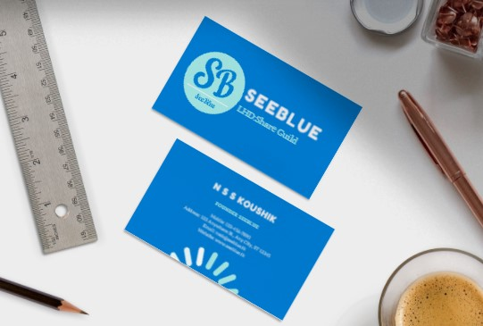
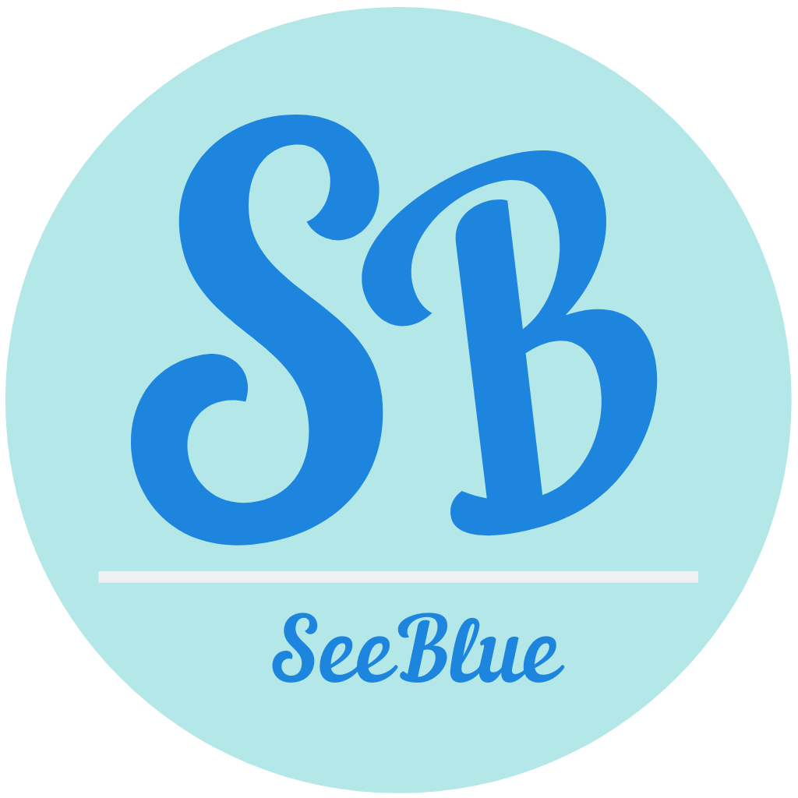
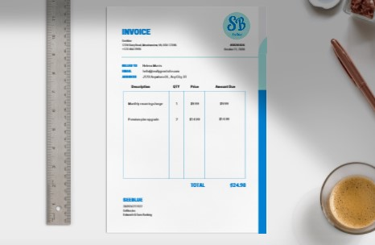
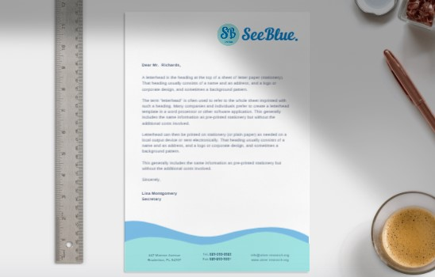

# Seeblue-guild-Brand-assets

A Brand for the fictional SeeBlue company, created as part of MLH: Local Hack Day Share 2021!

---

## Business Card – SeeBlue

<a href="SeeBlue-Buisness-Card/SeeBlue-Buisness-Card.pdf">View PDF</a>

<a href="https://www.canva.com/design/DAEayOdHCwM/CFnn1SquEppAjrcrtFjoBA/view?utm_content=DAEayOdHCwM&utm_campaign=designshare&utm_medium=link&utm_source=homepage_design_menu">Use as template</a> (external link to Canva)

---

## Main Logo

<a href="Seeblue-Main-Logo/Seeblue-Main-Logo.pdf">View PDF</a>

<a href="https://www.canva.com/design/DAEaxyH4KFY/aqflx7JRHafiz7OFLRiWUQ/view?utm_content=DAEaxyH4KFY&utm_campaign=designshare&utm_medium=link&utm_source=homepage_design_menu">Use as template</a> (external link to Canva)

---

## SeeBlue Member – Postcard

<a href="SeeBlue-postcard/SeeBlue-postcards.pdf">View PDF</a>

<a href="https://www.canva.com/design/DAEaxyuCz-0/isag5hKKFeA8j1PDTu8B_g/view?utm_content=DAEaxyuCz-0&utm_campaign=designshare&utm_medium=link&utm_source=homepage_design_menu">Use as template</a> (external link to Canva)

---

## Invoice Design

<a href="SeeBlue-Invoice/SeeBlue-Invoice.pdf">View PDF</a>

<a href="https://www.canva.com/design/DAEayE2m0yA/kLek2tcw2A_9sFaftc5v8g/view?utm_content=DAEayE2m0yA&utm_campaign=designshare&utm_medium=link&utm_source=homepage_design_menu">Use as template</a> (external link to Canva)

## LetterHead Design

<a href="SeeBlue-LetterHead/SeeBlue-LetterHead.pdf">View PDF</a>

<a href="https://www.canva.com/design/DAEayITBENI/m3v8G9XTnCiPeBt3y-WYxw/view?utm_content=DAEayITBENI&utm_campaign=designshare&utm_medium=link&utm_source=homepage_design_menu">Use as template</a> (external link to Canva)

